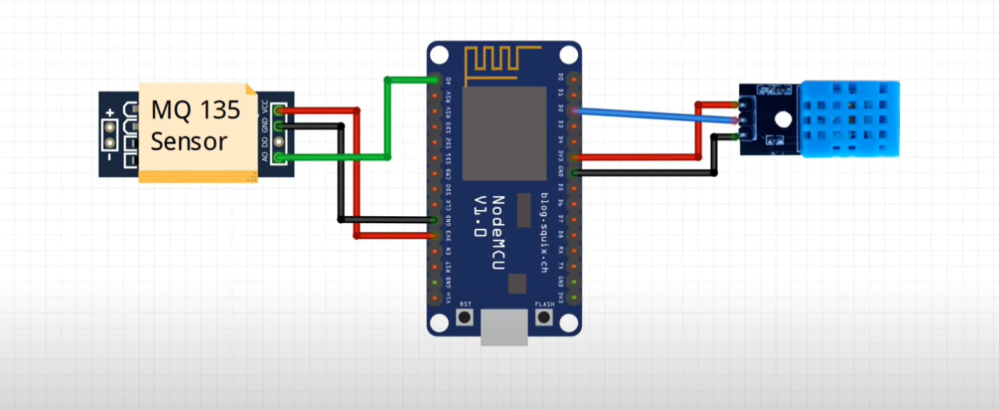
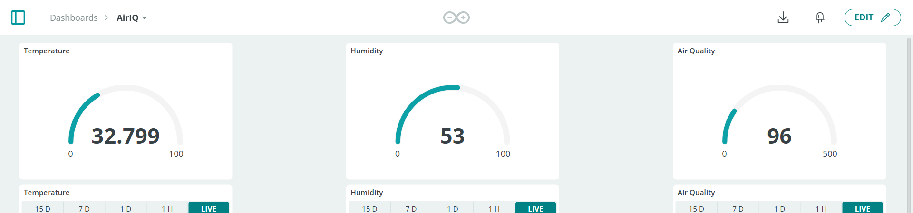

# 🌫️ AirIQ – Intelligent Air Quality Monitoring System

Developed AirIQ, an intelligent air quality monitoring system using NodeMCU ESP8266, MQ-135 gas sensor, and DHT11 sensor to detect air pollutants (NH3, alcohol, benzene, smoke, CO₂) and environmental parameters (temperature, humidity). Integrated with Arduino IoT Cloud for real-time data visualization via an intuitive dashboard, enabling effective monitoring and interpretation of air quality metrics to support data-driven decision making.

> 🔍 Built for smarter, data-driven air quality management in indoor spaces.

---

## 📑 Table of Contents

- [Overview](#overview)
- [Hardware Components](#hardware-components)
- [Wiring Diagram](#wiring-diagram)
- [Software--Dependencies](#software--dependencies)
- [Code Example](#code-example)
- [Arduino-IoT-Cloud-Setup](#arduino-iot-cloud-setup)
- [Usage-Instructions](#usage-instructions)
- [Demo-Video](#demo-video)
- [Dashboard-Screenshot](#dashboard-screenshot)
- [License](#license)

---

## Overview

AirIQ is a real-time, cloud-connected air quality monitoring system designed to:

- Detect harmful gases and pollutants using **MQ-135**
- Monitor environmental metrics using **DHT11**
- Provide live data via **Arduino IoT Cloud Dashboard**
- Enable smarter air quality decisions for homes, offices, and labs

---

## Hardware Components

| Component                            | Quantity |
|--------------------------------------|----------|
| NodeMCU ESP8266 (AMICA CP2102)       | 1        |
| MQ-135 Gas Sensor                    | 1        |
| DHT11 Temperature & Humidity Sensor  | 1        |
| Jumper Wires & Breadboard            | 1 set    |
| USB 5V Power Supply                  | 1        |

---

## Wiring Diagram

| Sensor/Module    | NodeMCU Pin | Function                       |
|------------------|-------------|--------------------------------|
| MQ-135 OUT       | A0          | Analog gas level input         |
| DHT11 DATA       | D2 (GPIO 4) | Digital temperature & humidity |
| VCC, GND         | 3.3V, GND   | Power Supply                   |

---

## Software--Dependencies

- **IDE:** [Arduino IDE](https://www.arduino.cc/en/software)
- **Board:** NodeMCU 1.0 (ESP-12E Module)
- **Required Libraries:**
  - [DHT Sensor Library by Adafruit](https://github.com/adafruit/DHT-sensor-library)
  - Arduino IoT Cloud (auto-generated `thingProperties.h`)

---

## Code Example

> ⚠️ Be sure to include your auto-generated `thingProperties.h` file from Arduino IoT Cloud.

#include "thingProperties.h"
#include "DHT.h"

#define DHTpin 4
#define DHTTYPE DHT11
DHT dht(DHTpin, DHTTYPE);
int sensor = A0;

void setup() {
Serial.begin(9600);
delay(1500);
initProperties();
ArduinoCloud.begin(ArduinoIoTPreferredConnection);
setDebugMessageLevel(2);
ArduinoCloud.printDebugInfo();
}

void loop() {
ArduinoCloud.update();

float hm = dht.readHumidity();
float temp = dht.readTemperature();
int airqualityvalue = analogRead(sensor);

humidity = hm;
temperature = temp;
airquality = airqualityvalue;

message = "Temperature = " + String(temperature) +
" Humidity = " + String(humidity) +
" Air Quality = " + String(airqualityvalue);

Serial.println(message);
}

---

## Arduino-IoT-Cloud-Setup

1. Go to [Arduino IoT Cloud](https://create.arduino.cc/cloud).
2. Create a new **Thing** and add the following cloud variables:
   - `CloudTemperatureSensor temperature`
   - `CloudPercentage airquality`
   - `CloudPercentage humidity`
   - `String message`
3. Download the auto-generated `thingProperties.h` file.
4. Design a custom dashboard for real-time monitoring.

---

## Usage-Instructions

1. **Assemble** the hardware as shown in the wiring diagram.
2. **Upload** the code via Arduino IDE (with `thingProperties.h` included).
3. **Connect** the NodeMCU to Wi-Fi using your Arduino IoT Cloud settings.
4. **Monitor** the live air quality and temperature data through the cloud dashboard.

---

## Demo-Video

> 🎥 *Click the image to download or open the demo video (MP4 file).*  

---

## Dashboard-Screenshot

> Real-time dashboard showing temperature, humidity, and air quality metrics.

---

## License

This project is licensed under the **MIT License**. See the [LICENSE](LICENSE) file for more information.
